# Loan Bank Dataset Data Analysis Project

A bank seeks to make smarter, safer lending decisions by analyzing customer data. This dataset offers valuable insights into customer characteristics and their loan repayment history. Identifying the traits that set apart a “good” customer from a “risky” one is crucial—not only to minimize losses but also to maximize the bank’s success and foster responsible borrowing. Unlocking these patterns empowers the bank to build stronger customer relationships and drive sustainable growth.

Note that in this file our focus is in EDA and have 7 parts; Data Understanding , Checking Data Quality, Univariate Analysis, Bivariate Analysis, Multivariate Analysis , and Hypothesis.

  
we show improtant info about general form of data:

  

  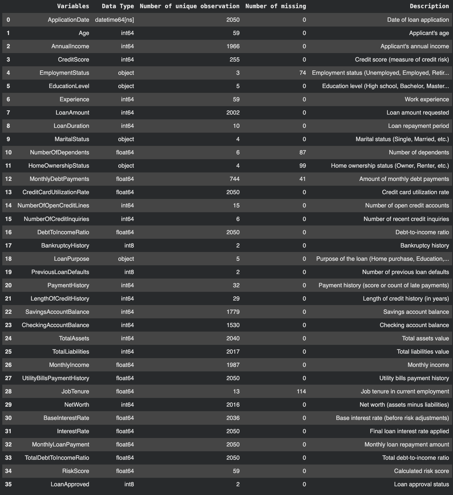
  

  

  
First of all, we want to show all possible inconsistencies in the dataset. Then, we have strategies for dropping or smoothing them : 

  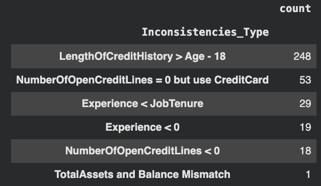
  

  

  
Some Results : 

  
 Univariate Analysis : 

  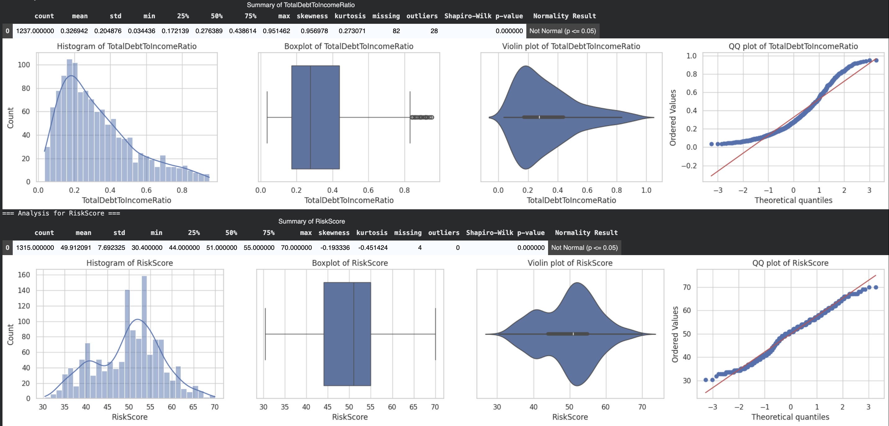
  

  

  

  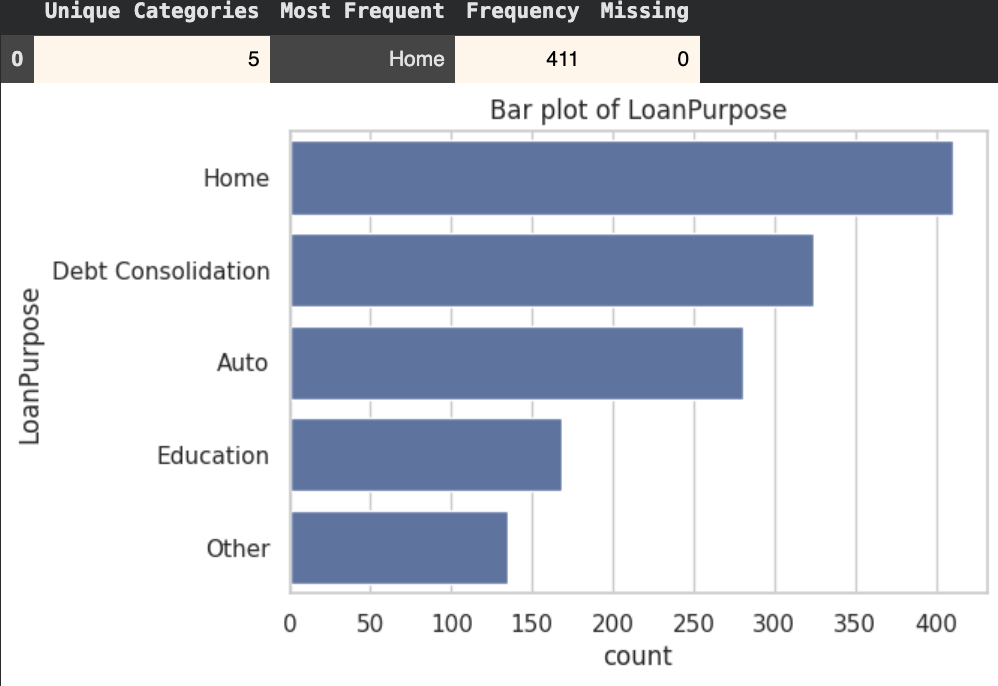
  

  

  
Multivariate Analysis : 

  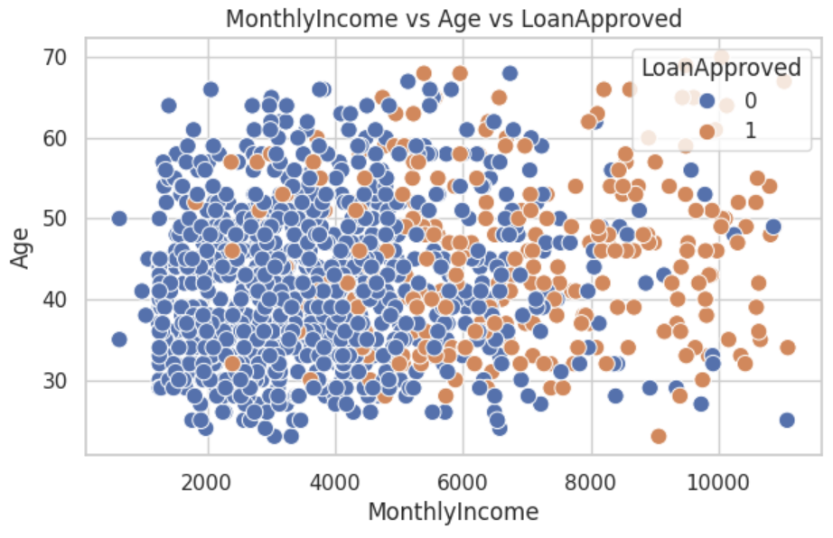
  

  

  
Correlation Matrix :  

  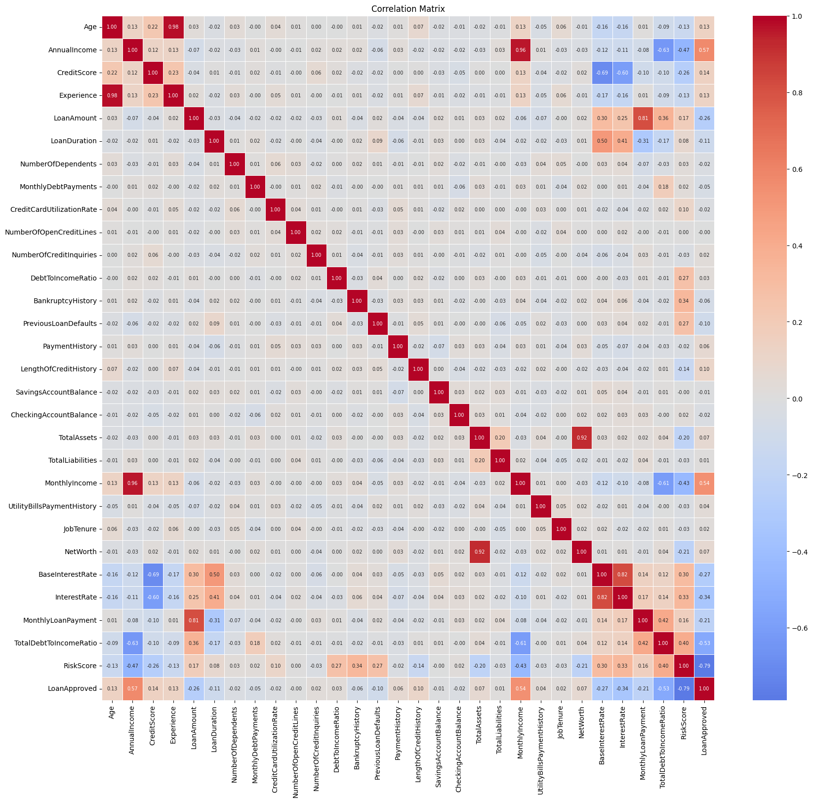
  

  

  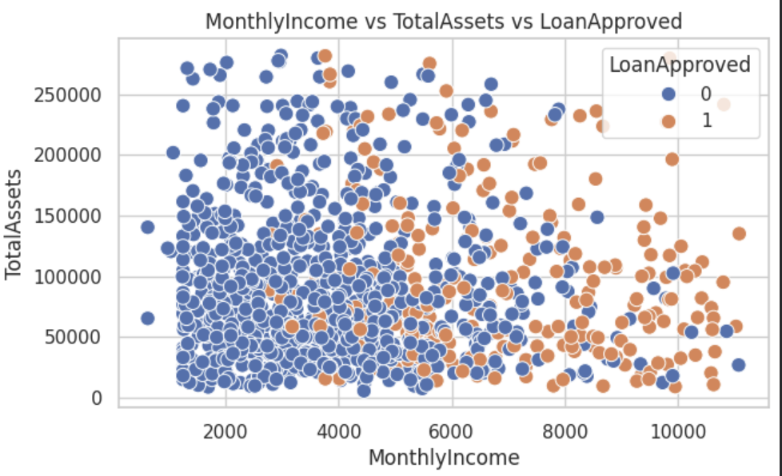
  

  

  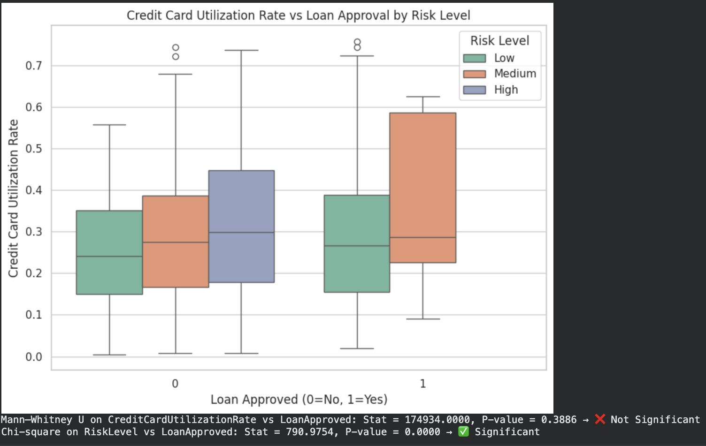
  

  

  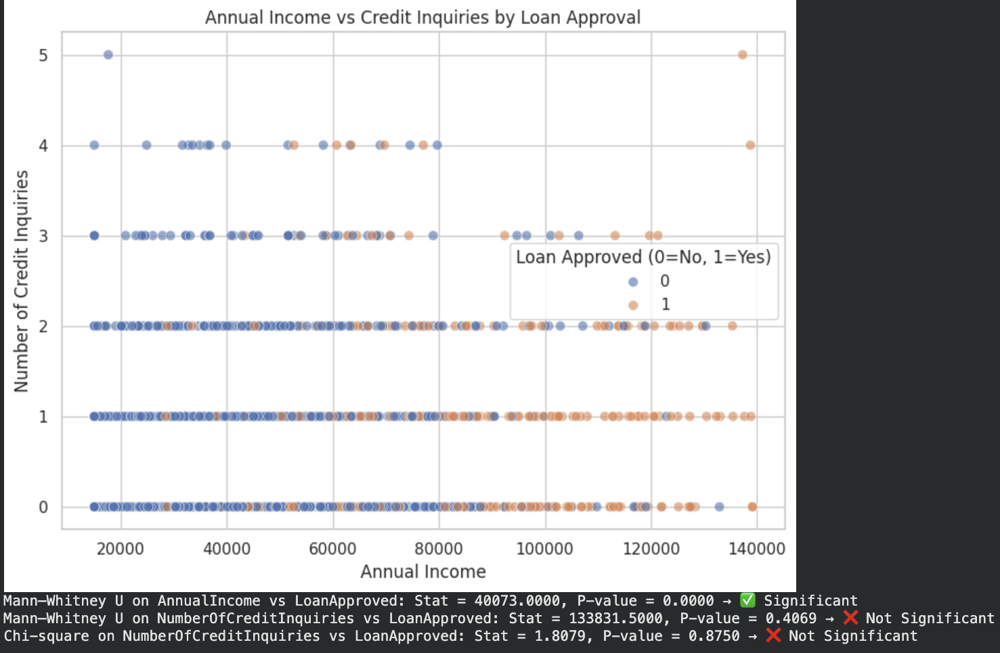
  

  

  
  

  

  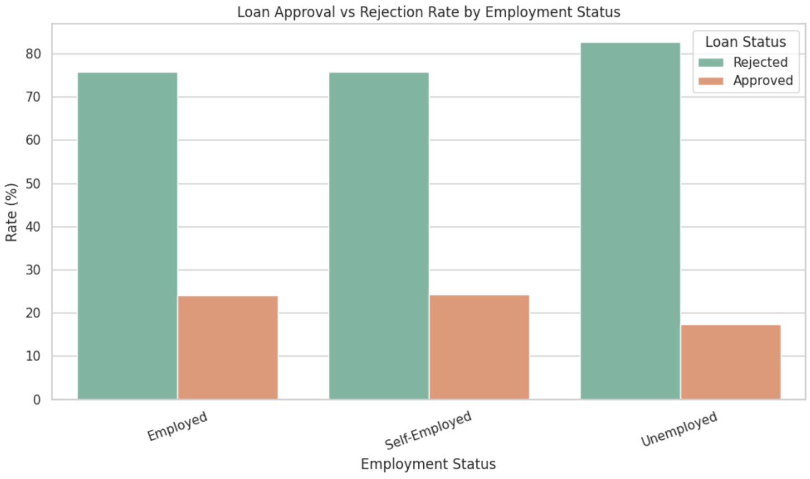
  

  

  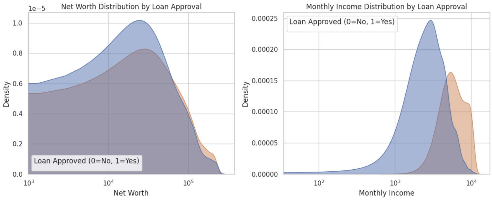
  

  

  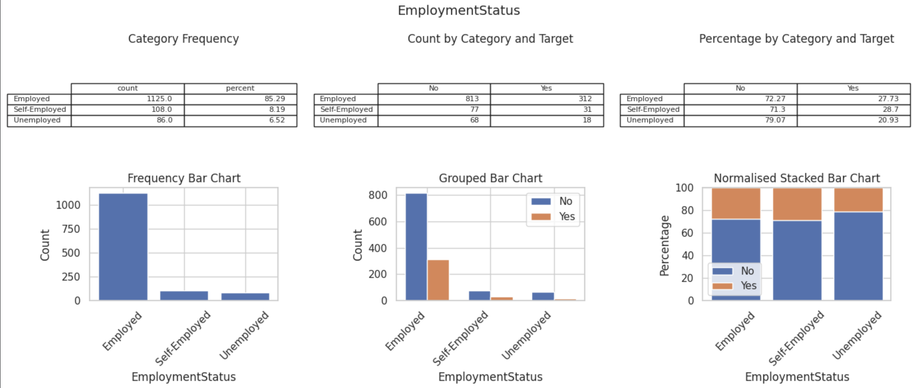
  

  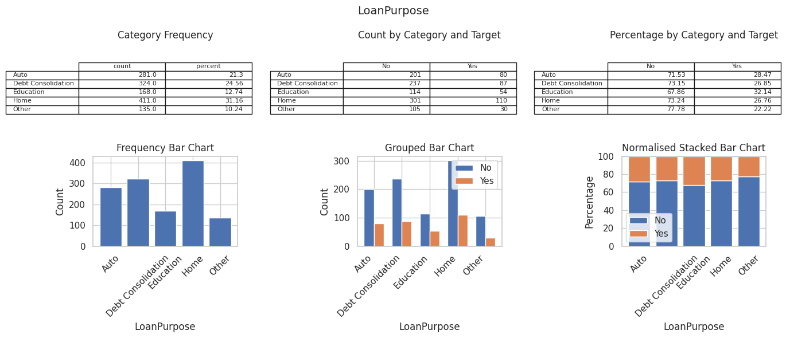
  

  

  
Key Performance Indicators (KPIs) : KPIs, or Key Performance Indicators, are measurable values that demonstrate how effectively a company is achieving its key business objectives. They help you monitor performance and make better decisions. 

  
Interest Rate Spread (IRS) : 

  
Reflects risk premium charged to the borrower.

  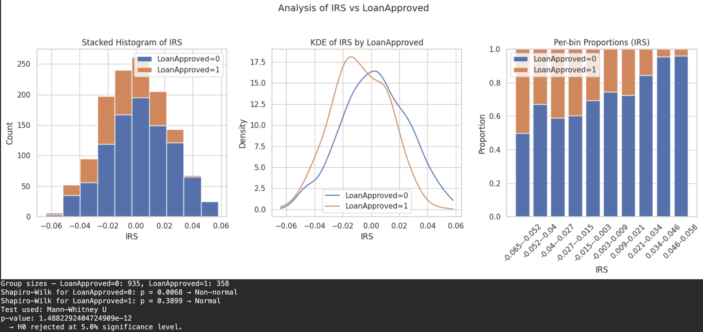
  

  

  
Hypothesis :

  
Approval rates differ across education levels.

  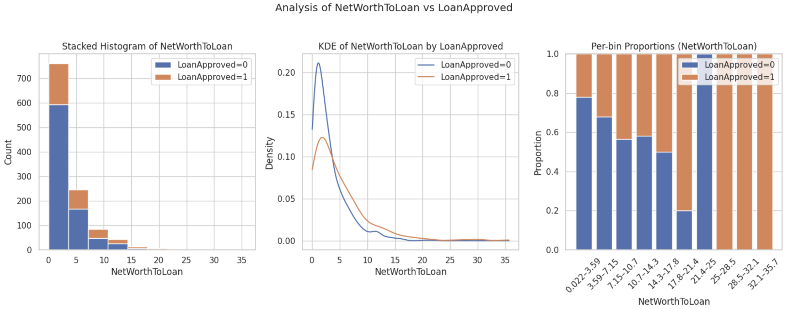
  

  
 => Loan approval rates differ significantly by education level

  

